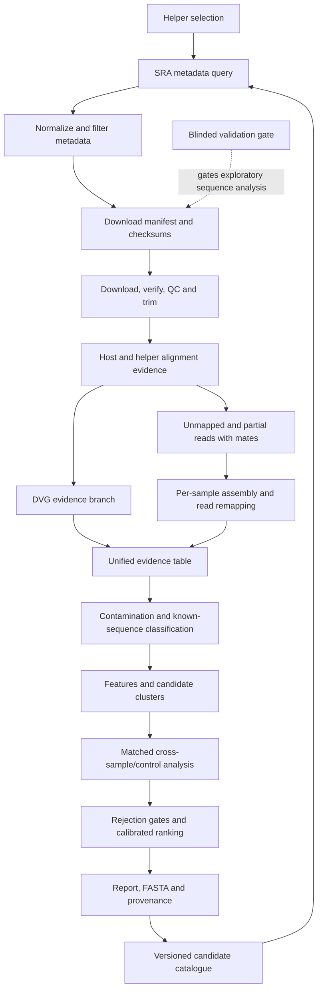

# Complete target architecture

**Historical design, not the released architecture.** The module/tool choices and downstream diagram below include unimplemented proposals. For current implementation and evidence boundaries, use the [README](../README.md), [M1–M16 roadmap](ROADMAP.md), and [M1–M6 scientific audit](M1_M6_SCIENTIFIC_AUDIT.md); the development handoff and capability audit below are historical snapshots. Do not use this design as evidence of installed tools, executable modules or validated scientific functionality.

## Boundaries and present scope

Phases 1–2 establish the repository and metadata path. Version 0.2.0 adds phase 3: budgeted ENA download with checksums and a portable baseline QC engine. Mapping and all later sequence inference remain a **design**, not executable or validated analyses. The runnable proof-of-concept extends to original/trimmed FASTQ and QC metrics. Biological satellite rediscovery is a separate future milestone.

Use a Python control layer with a prompt-based CLI now and a local web interface later. The future web interface submits jobs to a worker and displays stage logs, disk estimates, validation state and cancellation/resume controls. Use Nextflow DSL2 for expensive read-processing stages, SQLite for local catalogue/provenance, and content-addressed reference snapshots. Run Linux tools through WSL2, a Linux host or an HPC executor. Keep download/compute budgets explicit; 100 datasets can have radically different costs.

## Data flow



Preserve every branch and rejection reason. Do not irreversibly discard reads on a weak host, microbial or helper match. DVG evidence joins the candidate evidence table; ambiguous junctions remain unresolved. Initial strict filtering should have an audited rescue branch in benchmarks so that short, divergent or low-abundance positives are not silently lost.

## Folder structure

```text
satellite_discovery/       implemented Python metadata modules
  database_query.py       bounded search, retry/throttle, response cache
  metadata.py             one record per run and ENA file enrichment
  metadata_filter.py      explicit exclusion and missingness reasons
  workflow.py             orchestration and manifest lifecycle
  report_generator.py     JSON/CSV/HTML
  cli.py, helpers.json    beginner prompts and extensible metadata queries
docs/                     architecture, validation and status
tests/                    offline parser, filter, transport and workflow tests
.github/workflows/        offline CI
runs/<id>/                local output, ignored by Git
  raw_metadata/           response bodies and provenance sidecars
  parameters.json
  manifest.json
  datasets.json/csv
  report.html, run.log
```

Planned directories: `workflow/modules/`, `config/references/`, `benchmarks/`, `catalogue/`, `containers/`. Add these only with real implementations; no placeholder modules pretending to execute analyses.

## Module contracts and recommended tools

| Phase/module | Input → output | Implementation choice / completion gate |
|---|---|---|
| 2 database_query / metadata_filter | helper/query → per-run dataset records | Implemented NCBI ESearch/EFetch and ENA file reports; offline and live checks |
| 3 sequence_downloader | approved bounded run manifest → verified FASTQ | HTTPS ENA where checksums available; SRA Toolkit prefetch/fasterq-dump fallback; space checks, retry, atomic completion |
| 3 quality_control | FASTQ → trimmed reads and QC metrics | fastp for short reads, FastQC/MultiQC for audit; retain original reads |
| 4 host_filter / helper_mapping | trimmed reads + frozen references → BAM/CRAM, flags and read partitions | Bowtie2 or minimap2 with SAMtools; paired-read and split alignment handling tested explicitly |
| 5 dvg_detector | alignments, junctions, helper segments → DVG evidence | Evaluate ViReMa against independent split-alignment evidence; validate separately for each virus/library type |
| 6 assembly | retained read partitions → contigs, graphs and remapping evidence | Compare rnaSPAdes and MEGAHIT on benchmark data; preserve short contigs and parameter sensitivity |
| 6 contamination_filter / classifier | contigs + reference snapshot → typed matches | BLASTn, translated DIAMOND search, explicit host/vector/microbial panels; Kraken2 optional triage |
| 7 satellite_feature_analyser | supported contigs → typed feature evidence | ORF enumeration, HMMER domains, RNAfold when appropriate; absent ORFs are not automatic rejection for satellite RNAs |
| 8 cooccurrence_analyser / scorer | sample-level abundance + controls → association evidence and ranking | Study-aware statistical models, multiple-testing correction, depth/batch adjustment; frozen rule version |
| 9–10 validation | withheld benchmark labels → performance and pass/fail artifact | Independent held-out studies and decoy/negative panels; no novelty gate pass by default |
| 11 discovery | passed gate + bounded datasets → computational candidate report | Disabled until biological validation acceptance is recorded |
| 12 candidate_database | sequences + evidence versions → clusters and additional occurrences | SQLite initially; MMseqs2/CD-HIT-EST clustering evaluated for short/divergent sequences; MAFFT and IQ-TREE only for alignable homologues |

Tool choices are evaluation candidates, not installed or pinned dependencies in this release. Primary documentation: [Nextflow resume](https://docs.seqera.io/nextflow/cache-and-resume), [fastp](https://github.com/OpenGene/fastp), [SRA Toolkit](https://github.com/ncbi/sra-tools), [SAMtools](https://www.htslib.org/), [SPAdes](https://github.com/ablab/spades), [MEGAHIT](https://github.com/voutcn/megahit), [BLAST](https://blast.ncbi.nlm.nih.gov/doc/blast-help/), [DIAMOND](https://github.com/bbuchfink/diamond). Verify compatibility and freeze exact versions/container digests at implementation time.

## Reference registry

Phase 3 implementation note: `sequence_downloader.py`, `quality_control.py` and `read_workflow.py` implement ENA-only retrieval and the standard-library QC baseline described in the README. The module table above retains mature tool choices; SRA Toolkit, fastp and MultiQC integration are not yet implemented. Read preparation can be exercised before biological validation; the validation gate applies to exploratory candidate discovery rather than routine download/QC.

Represent each reference collection with category, source URL, accessions **with version**, release/retrieval date, taxonomy snapshot, licence, SHA256, build command, tool version and benchmark holdout exclusions. Categories: known satellites/satellite RNAs; helper-dependent elements; documented DVGs; target/related viral genomes including segments; human genome/transcriptome; microbial references; vectors/synthetic constructs; adapters; and annotated reagent/cell-line contaminants.

Curated provenance is essential: a bacterial species is not automatically a reagent contaminant and a common contaminant may also be biologically present. Assign context-dependent evidence rather than indiscriminate taxonomic rejection. Updates create a new immutable snapshot; never silently alter an in-progress run. Initial reference construction remains unimplemented.

## DVG and contamination decisions

The future evidence contract retains helper nucleotide matches, aligned fraction, segment origin, termini, junction coordinates/support, coverage, and whether a deletion/rearrangement explanation is supported. Similarity alone is insufficient; divergence and reference incompleteness also prevent a strong negative conclusion. Packaging or replication compatibility is an exploratory annotation, not a dependency inference. Do not infer circularity or genome completeness from an assembler label alone.

Contaminant records require reference provenance, alignment identity/coverage, supporting read evidence and sample context. Index hopping requires lane/batch information and relative abundance context; if unavailable, mark this assessment unknown. Technical replicates and repeated archive submissions must not count as independent discoveries.

## Evidence, scoring and output contract

Every metric uses `value`, `method`, `version`, `evidence_files`, and `status` (observed/missing/not_applicable). Missing evidence is never zero or a favourable score. In particular DVG/contamination **probability** remains null unless a calibrated model exists; otherwise expose evidence levels without probability language.

Provisional later-stage score specification, to calibrate and freeze on development benchmarks: independent sample/study recurrence 0–25; adjusted helper association 0–25; read/assembly evidence 0–25; independently supported satellite-like features 0–15; sufficiently powered controls 0–10. Subtract 0–40 for unresolved artefact/DVG/contamination evidence and 0–15 for confounding/single-study dependence, then clamp to 0–100. List each contribution and missing assessment. This is a ranking index, not posterior confidence; no class thresholds are validated yet. Strong rejection gates take precedence over score.

Future classes: 0 artefact; 1 host/microbial/technical contamination; 2 known viral entity (subtype distinguishes known satellite and coinfecting virus); 3 probable helper-derived DVG; 4 unclassified; 5 potential helper-associated element; 6 satellite-like candidate; 7 high-priority novel helper-dependent candidate. Classes 5–7 require complete mandatory evidence and a passed validation gate. Ambiguous assembly/DVG cases remain class 4, not promoted by missing data.

Final candidate schema: candidate ID and sequence checksum; FASTA sequence; length; helper label; accession/BioProject/BioSample lists; positive/negative/unknown sample counts; independent study counts; supporting reads/pairs; coverage; ORFs/proteins; database matches; helper similarity; DVG and contaminant evidence; nullable calibrated probabilities; satellite/association/ranking scores; class; score contributions; rejection reasons; follow-up; reference and analysis versions. Metadata-only reports intentionally omit invented candidate rows.

## Cross-dataset statistics and catalogue

Use separate tables for samples, runs, studies, references, sequences, clusters, observations, evidence and score versions. Sequence hashes identify exact sequences; cluster IDs identify explicitly versioned similarity groupings. Keep accession-to-biological-sample resolution distinct from run identity. A candidate triggers a budgeted metadata search/download/remapping job, not an assumption that all SRA reads are directly sequence-searchable.

Cluster recurrence uses representative screening followed by per-sample mapping confirmation. Normalize abundance by usable library depth and account for helper load, study, batch, tissue and library design. Prefer within-study case/control contrasts and held-out-study replication over pooled correlation. Correct multiple testing and report uncertainty and detection limits. A consensus is an analytical artefact and must not be substituted for an observed complete genome.

## Interface and reproducibility roadmap

The later UI exposes helper, experiment/run budget, QC configuration, potential controls, reference snapshot, storage estimate and benchmark state. Show stage-specific progress and explain partial failures. The discovery button cannot execute unimplemented stages or bypass validation. Store exact commands, container digests, seeds, config hashes, reference hashes, workflow commit, scheduler resources, stdout/stderr, intermediate files and report hashes. Nextflow resume requires both work data and task cache.
